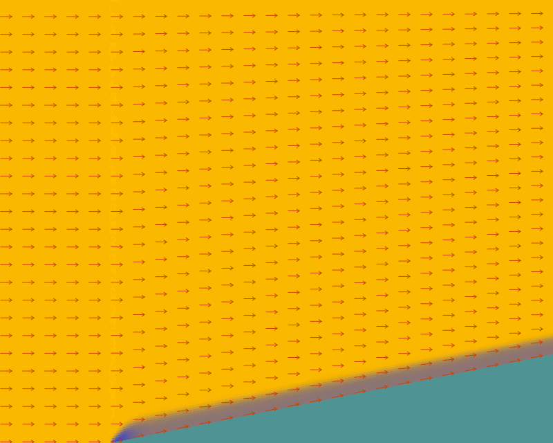
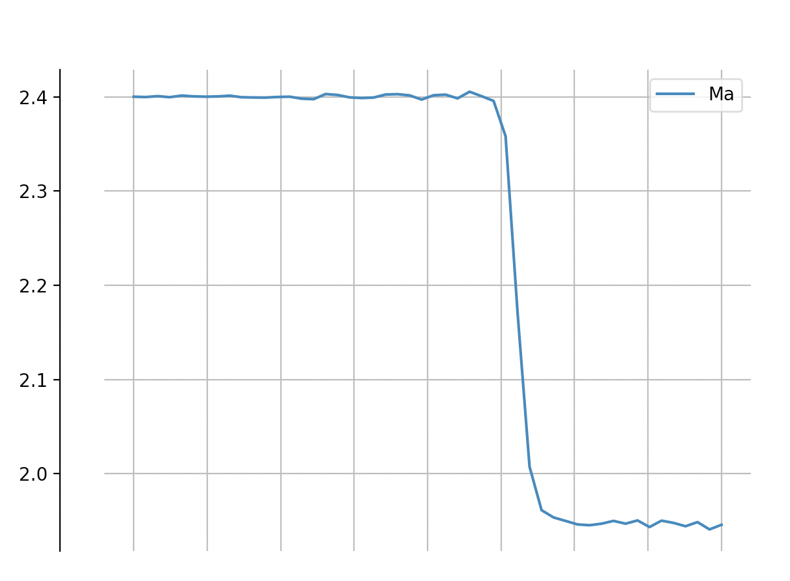
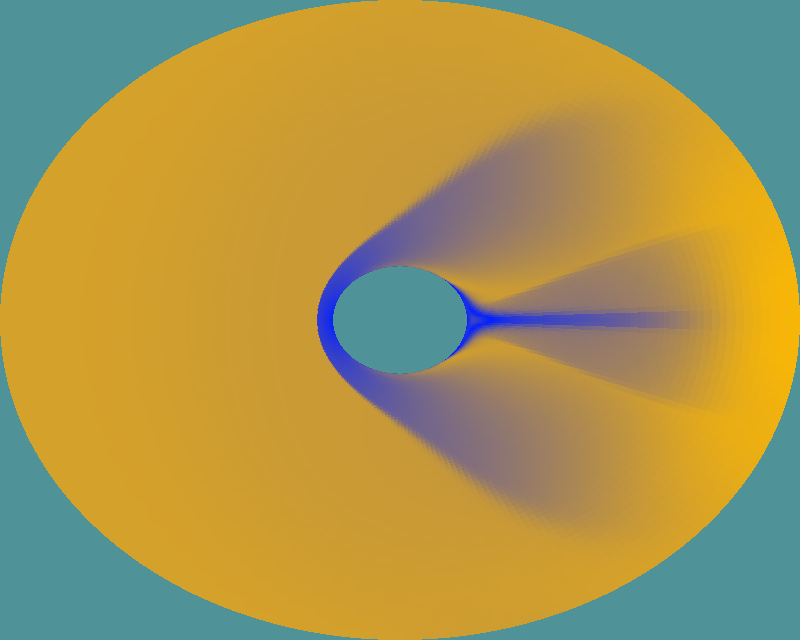
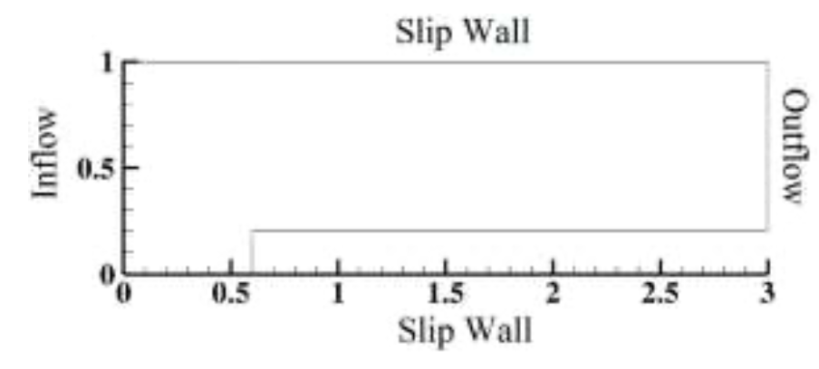
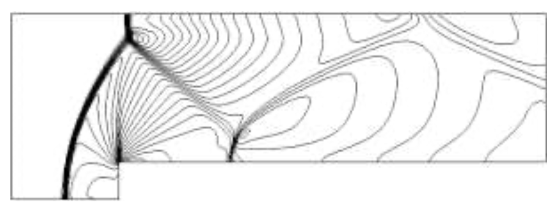
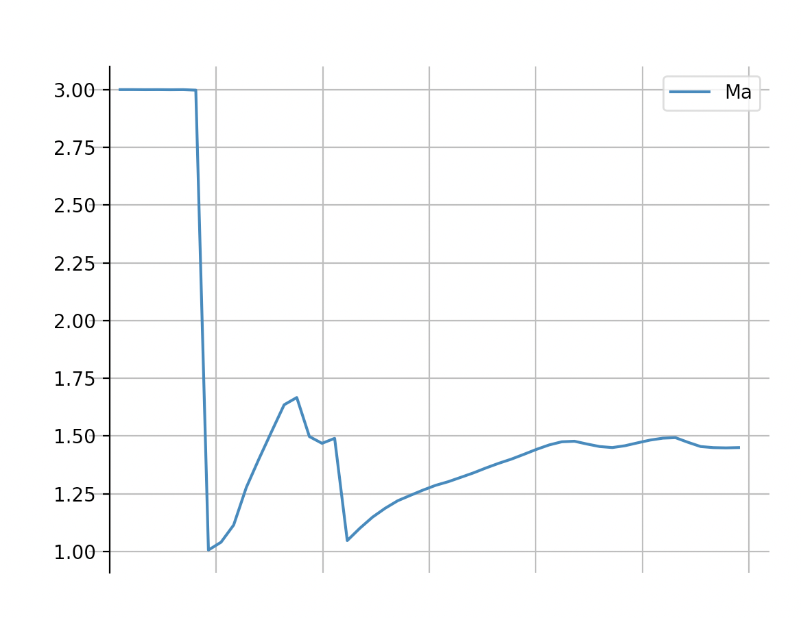

# 2D FVM Compressible CFD Solver for multiblock structured mesh in Taichi language

The project is an attempt to exploit the potential of Taichi language in the field of computational simulation of compressible fluids by finite-volume-method.

## Main objectives

- exploit Taichi language in expressiveness, parrallezation, GPU utilization, and etc.
- try to utilize Taichi's data oriented features for scalability
- construct a ground base CFD framework for structured mesh with FVM
- concentrate on transonic to supersonc regime for compressible phenomena, with posiible modifications for near-incompressible low Mach number fluid simulations
- availability for complex boundary shapes, extensions to high-order methods and etc., as a discussion material for physical based against visual effect biased simulations

## Features

The introduce of multiblock structured mesh and FVM features allow for simulation capabilities of various field shape and complex boundaries without losing the potential easier extension to high-order interpolation methods in both space and time differentiations, multigrid and etc.

Current features are concentrated on basic program structure and shockwave-catching convection methods as a start.

Current Features:

- `Finite volume method`
- `2D structured mesh`
- Compressible fluid simulation with shockwave catching capabilities and heat transfer
- Euler and Navier-Stokes equations (`WIP, laminar diffusion coefficients, validation still needed with test cases`)
- Convection items suitable for shockwave catching using Godnuv type Riemann solvers: **van Leer / modified Roe / Roe-RHLL methods** (`Validation still needed`)
- Physical quantities on the cell surface and graidents are caculation by interpolation / cell integration with adjacent cells (`Currently simple 1st to quasi-2nd order`)
- RK3 time marching
- Dual time marching with RK3 (`WIP, convergence problems exist and validations are needed`)
- One virtual votexes on every block edge for boundary calculations
- Multiple types of boundary conditions: supersonic inlet/outlet, symmetry, non-slip/slip wall
- Interconnection boundary data transfer between block surfaces
- Simple GUI output on-the-fly for field result, with options to draw grid nodes, cell centers, velocity arrows or surface normal direction arrows
- Simple curve plot on-the-fly (`Currently one line with evenly spaced monitor points only`)

## Usage

Separation of simulation logic, variable allocations and gui works into main MultiblockSolver, BlockSolver and Drawer classes.

The input configurations can be written case by case in script files, examples are shown in `Test cases` section and `case_*_multiblock.py` files.

*TODO: more descriptions*

## Test cases

### supersonic wedge

The case is modified replication from [3] for validation of shock wave catching capabilities in one oblique shock against an angled wedge with inflow Mach number 2.4.

    
    

The result shows straight line shaped shock front and appropriate turning angle. Mach number across a x-direction line is plotted. Compared with theoretical precise answer, some level of oscillation and a small higher number is observed below shock wave front. `Some bug fix or optimisations still needed.`

### blunt shock wave around cylinder

The case is also from [3] for validation on blunt type shock waves. Mach number 3.0 is used instead.

The case also utilizes circular shaped grid mesh in favor of FVM method, a cutting boundary between surfaces in i0 and iend direction of the single block to provide validation coverage on interconnected data transfer.

    
    

The shock wave simulated with Roe-RLHH method is showing appropriate shock wave shape and carbuncle-free features. `More quantitative analysis is needed.`

### forward-facing step

The case is also drawn from [3]. The simulation configurations and density contour in the thesis is shown below.

    
    

The case is used as validations for shockwave interactions(reflections against wall). And it also covers multi-block issues using two rectangular grid blocks.

    
    

The result shows appropriate shock shapes using van Leer method. `More validations are needed as both Roe-RHLL and dual-time marching is caught in convergence problems. And further precise time-related qunatitative analysis is needed`

## Future work

- Bug fixes and equation implementations checks
- Can Taichi's autodiff feature be applicated on FVM?
- Higher order method and interpolations with possible 2 virtual vortexs on the surface, for example
- Unstructured mesh FVM
- Multigrid/multi-resolution, implicit time marching
- Levelset, multiphase simulations, fluid-solid interactions, etc.
- Performance issues

## Bibliography

[[1] Hiroaki Nishikawa and Keiichi Kitamura. Very simple, carbuncle-free, boundary-layer-resolving, rotated-hybrid Riemann solvers. Journal of Computational Physics 227 (2008) 2560–2581](https://www.researchgate.net/publication/222546386_Very_simple_carbuncle-free_boundary-layer-resolving_rotated-hybrid_Riemann_solvers)

[[2] Jameson, Antony. (1991). Time dependent calculations using multigrid, with applications to unsteady flows past airfoils and wings. 10.13140/2.1.2459.3608.](https://www.researchgate.net/publication/267982395_Time_dependent_calculations_using_multigrid_with_applications_to_unsteady_flows_past_airfoils_and_wings)

[[3] Celik, Bayram & Turk, Adem. (2017). A 2-D Finite Volume Navier-Stokes Solver for Supersonic Flows. Anadolu University Journal of Science and Technology A- Applied Sciences and Engineering. 18. 10.18038/aubtda.298656. ](https://www.researchgate.net/publication/320076700_A_2-D_Finite_Volume_Navier-Stokes_Solver_for_Supersonic_Flows)

